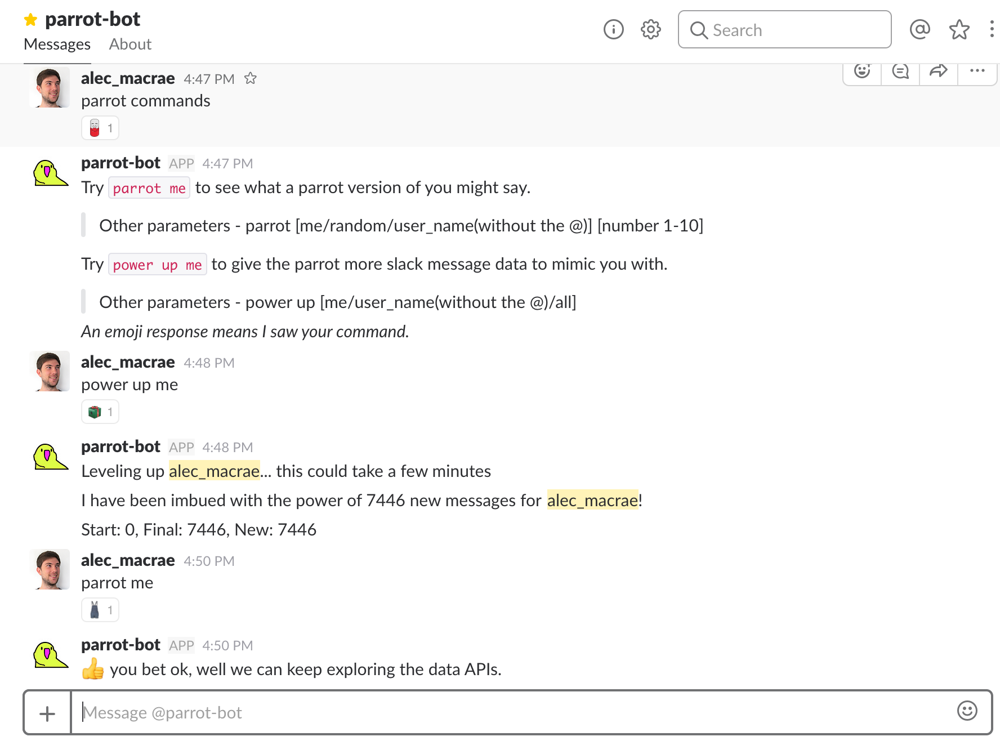

# parrot_bot

## install required packages
```
$ virtualenv venv
$ source venv/bin/activate
(venv) $ pip install -r requirements.txt
```

## Generate required slack tokens

In order to connect to slack, we will need to generate an authentication token for our bot. You can create a new bot and get the authentication token for it [here](http://my.slack.com/services/new/bot).

paste token in parrot_bot/parrot_bot.py
```
BOT_TOKEN = "insert bot token here"
```

In addition, if you want your bot to be able to use the Slack API to query slack for messages, you will need to generate another token since, by default, bots are not allowed to do this. The most straightforward way is to [generate a token](https://api.slack.com/docs/oauth-test-tokens) for yourself, and allow the bot to use your token for querying purposes. Keep in mind that this will allow the bot to see and access everything you can see in slack, including private messages.

paste token in parrot_bot/parrot_bot.py
```
GROUP_TOKEN = "insert slack group token here"
```

## Set up Home Channel and Startup Channel

Run the following to print out a list of channel ids next to the regular channel name.

```
(venv) $ python parrot_bot/get_channel_list.py -ch channels
```

Can replace `channels` with `im` or `mpim` to looks fir direct message ids or multi-party IM ids.

Use the output to paste the ids of desired channels into these lines in parrot_bot/parrot_bot.py

```
HOME_CHANNEL = "insert channel id of home channel for bot"
STARTUP_CHANNEL = "insert channel id of startup channel for bot"
```

## Run parrot_bot

```
(venv) $ python parrot_bot/parrot_bot.py
```

Then you should just be able to start spewing commands!


